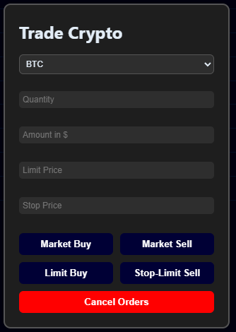
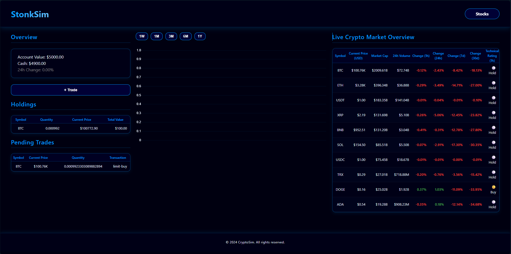
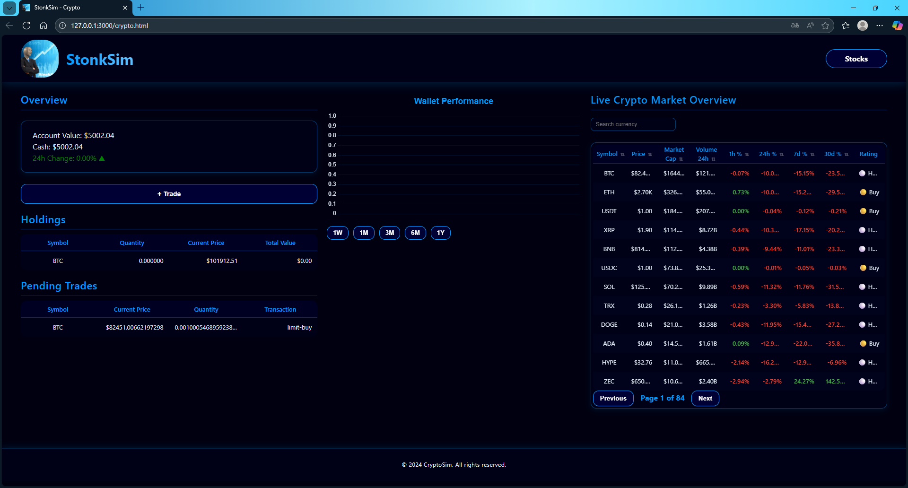
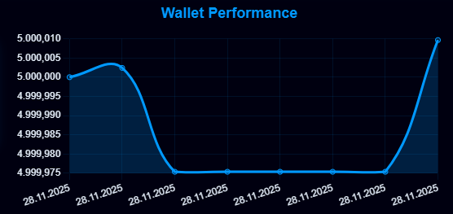
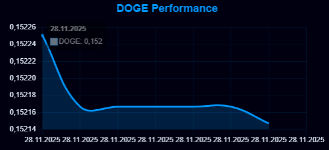
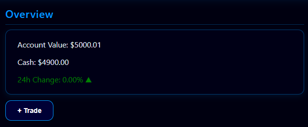

# Lern-Periode 7
24.10. bis 19.12.2025

# Grob-Planung

In dieser Lernperiode möchte ich zusammen mit @HerrDextro einen Crypto- und Aktiensimulator wie [Investopedia](https://www.investopedia.com/simulator) erstellen. Dabei haben wir uns dafür entschieden, dass ich den Crypto-Teil übernehme. Dafür habe ich
Für welche API möchten Sie ein eigenes front end erstellen?
Welche groben Funktionalitäten soll Ihr front end zur Verfügung stellen?
Was möchten Sie insbesondere dabei lernen oder üben?

## 24.10.
- [X] Arbeitspaket 1: Erstellen Sie mehrere Skizzen von Ihrem front end. Überlegen Sie sich auch, welche Elemente die Interaktion mit dem back end auslösen und wie sich die Oberfläche dadurch verändert. Bauen Sie auch Interaktionen ein, die keinen Aufruf der API benötigen, sondern sich im client bearbeiten lassen (sortieren, suchen etc.)
- [X] Arbeitspaket 2: Setzen Sie in HTML und CSS Ihren Entwurf auf rudimentäre Weise um.
- [X] Arbeitspaket 3: Schreiben Sie ersten JS-Code als proof of concept (bspw. Meldung bei Klick auf Knopf-Element)

Heute habe ich zunächst nach einer API gesucht, um Daten zu verschiedenen Kryptowährungen live abzurufen. Dabei stiess ich auf die API von [CoinMarketCap](https://coinmarketcap.com/api/), die mir mit einem Limit von 30 API-Calls pro Minute und insgesamt 10.000 pro Monat fürs Erste ausreicht. 

Anschliessend habe ich mir Gedanken zum Aufbau der Website gemacht. Ich liess mich dabei stark von *Investopedia* inspirieren, entschied mich aber gleichzeitig, die Struktur etwas umzubauen und zusätzlich einige weitere Informationen anzuzeigen.  

Danach habe ich bereits einen ersten HTML-Teil erstellt – eine Tabelle zum Anzeigen der aktuellen Daten – und mithilfe von [ChatGPT](https://chatgpt.com/) mit API-Calls über JavaScript experimentiert. Für einige Kryptowährungen konnte ich bereits den API-Call zum Befüllen der Tabelle einrichten. 

Dabei fiel mir allerdings auf, dass etwas nicht funktionierte. Um den Fehler zu untersuchen, führte ich den API-Call nochmals über die Browser-Konsole aus und entdeckte durch die Fehlermeldungen, dass direkte Anfragen vom Browser aus aufgrund der **CORS-Richtlinien** blockiert werden. Daraus folgt, dass ich die Daten über einen kleinen **Server-Proxy** abgerufen werden musste, um die API korrekt nutzen zu können.

## 31.10.
- [X] **CSS:** Grundlegendes CSS-Design erstellen. Die Website soll ein Dunkles Design verfolgen und ausserdem auf das Design des Aktienteils abgestimmt werden.
- [X] **HTML** Header und Footer im HTML finalisieren und fehlende HTML-Elemente für *Overview*, *Holdings*, *Performance (Kurs)*, *Pending Trades* etc. einfügen.
- [X] **Kurs:** Das JavaScript um eine Funktion ergänzen um mit aus dem API-Call erhaltenen historischen und aktuellen informationen ein Kurs-Display für die betreffende Kryptowährung zu erstellen.
- [X] **Speichern:** Informieren über das Speichern von Account-Daten (json) wie z.B. Account Value, Holdings etc.

Heute habe ich zunächst die Fehlenden HTML-Elemente ergänzt und anschliessend an dem Aussehen der Website gearbeitet. Dabei achtete ich darauf, die Struktur möglichst so umzusetzten wie letzte Woche auf Papier geplant. Farblich entschied ich mich für ein Dunkleres Design mit Blau und Schwarz. Anschliessend informierte ich mich über das Internet, wie ich die benötigten Liniendiagramme für die Wallet-Performance und die Crypto-spezifische Performance umsetzten könnte. Ich stiess dabei auf **Chart.js**. Damit erstellte ich anschliessend ein Liniendiagramm für die Wallet-Performance, das automatisch die täglichen Änderungen basierend auf den gespeicherten Account-Daten anzeigt.  
Zusätzlich habe ich ein separates Liniendiagramm für die Performance einzelner Kryptowährungen implementiert, das beim Anklicken eines Coins in der Live-Markt-Tabelle geladen wird.  

Um die Daten darzustellen, nutze ich **localStorage**, sodass alle Veränderungen durch Käufe oder Verkäufe direkt in den Charts sichtbar werden. Die Buttons zur Auswahl verschiedener Zeiträume (1W, 1M, 3M, 6M, 1Y) habe ich ebenfalls eingebunden und die Chart-Updates so programmiert, dass sie den gewählten Zeitraum korrekt berücksichtigen. Die Wallet-Daten und die historischen Kursinformationen der einzelnen Coins werden automatisch im LocalStorage gespeichert, sodass die Charts bei jedem Laden der Seite oder nach Trades aktuell bleiben.

Die Webpage sieht im Moment so aus:


## 07.11.
- [X] **Trade-Funktionen erweitern:** Limit-Orders und Stop-Limit-Orders implementieren und das Trade-Formular übersichtlicher gestalten.  
- [ ] **Live Market Overview verbessern:** Mehr Kryptowährungen hinzufügen und sicherstellen, dass alle Daten korrekt angezeigt werden.  
- [X] **Fehlerbehandlung:** Probleme beim "Today's Change"-Display beheben und Ladeanzeigen oder Fehlermeldungen für ungültige Daten integrieren.  
- [X] **Charts optimieren:** Wallet- und Crypto-Performance-Charts interaktiver gestalten und die Auswahl verschiedener Zeiträume stabilisieren.

Heute habe ich die **Trade-Funktionen** im Crypto-Teil stark erweitert und das Trade-Panel für Nutzer ausserdem benutzerfreundlicher gestaltet. Das Panel erlaubt nun die Eingabe entweder der Menge (*Quantity*) oder des Betrags in Dollar (*Amount*). Nur eines der beiden Felder muss ausgefüllt werden, das jeweils andere wird automatisch berechnet. Die Berechnung erfolgt dynamisch über folgende Logik:

```javascript
if (!quantity && amount) quantity = amount / currentPrice;
if (!amount && quantity) amount = quantity * currentPrice;
```
Das Panel selbst sieht nun so aus:



Die **Market Buy**- und **Sell-Funktionen** habe ich so umgesetzt, dass auch Coins, die noch nicht in den Holdings vorhanden sind, korrekt gehandelt werden können. Dabei werden die *Live-Marktdaten* aus dem LocalStorage genutzt, um den aktuellen Preis zuverlässig zu bestimmen.  

Ein Problem, das ich gelöst habe, war, dass Buttons nach wiederholtem Öffnen des Panels nicht mehr reagierten. Die Lösung war, die Buttons beim Öffnen des Panels **zu klonen** und neue Event-Listener zuzuweisen:

```javascript
const newBtn = oldBtn.cloneNode(true);
oldBtn.parentNode.replaceChild(newBtn, oldBtn);
newBtn.addEventListener("click", () => executePanelOrder("market-buy"));
```

Nach jedem Trade werden **Holdings**, **Cash-Bestand** und die **Wallet-Daten** sofort aktualisiert. Dadurch spiegeln sich alle Änderungen direkt in den Tabellen und Charts wider. Die Wallet-Chart und die Crypto-Performance-Charts aktualisieren sich automatisch und berücksichtigen verschiedene Zeiträume (*1W*, *1M*, *3M*, *6M*, *1Y*):

```javascript
document.querySelectorAll(".time-range-btn").forEach(btn => {
    btn.addEventListener("click", () => updateWalletChart(btn.dataset.range));
});
```

Zusätzlich habe ich die **Pending Orders** implementiert. Limit-Buy- und Stop-Limit-Orders werden im LocalStorage gespeichert und regelmässig überprüft. Sobald die Bedingungen erfüllt sind, werden die Orders automatisch ausgeführt:

```javascript
if (o.type === "limit-buy" && price <= o.limitPrice) {
    handleMarketBuy(o.symbol, o.quantity);
    updatedOrders = updatedOrders.filter(ord => ord !== o);
}
```

Abschliessend habe ich noch die **Fehlerbehandlung** verbessert: Ungültige Eingaben werden abgefangen, Warnungen werden angezeigt und fehlende Daten (z. B. Coin nicht gefunden) führen nicht mehr zu Fehlfunktionen.  

Ich konnte heute also insgesamt die Interaktivität der Seite deutlich erhöhen und die Kernfunktionen für den Crypto-Handel auf ein stabiles Fundament stellen.



## 14.11.
- [X] **Trade-Funktionen erweitern:** Limit-Orders und Stop-Limit-Orders fertigstellen, Trade-Panel übersichtlicher gestalten, automatische Aktualisierung von Holdings und Wallet-Daten nach Orderausführung sicherstellen.  
- [ ] **Order-Historie einführen:** Alle ausgeführten und stornierten Orders mit Coin, Menge, Preis und Zeitstempel anzeigen.  
- [X] **Live Market Overview verbessern:** Mehr Coins anzeigen, Sortier- und Suchfunktionen einbauen, korrekte Anzeige aller Daten sicherstellen.  
- [X] **Code aufräumen:** JS-Code in mehrere Dateien auslagern (*`market.js`*, *`trade.js`*, *`charts.js`*), um Übersichtlichkeit und Wartbarkeit zu erhöhen.

Zunächst habe ich mich heute damit beschäftigt, die **Trade-Optionen zu überarbeiten und zu ergänzen**. Der Benutzer kann nun neben Market Orders und *Limit-Buy* auch *Limit-Sell*, *Stop-Limit-Sell*, *Stop-Loss-Sell* und *Take-Profit* anwenden. Ausserdem habe ich auch das **Design des Trade-Overlays** übersichtlicher gestaltet.

Anschliessend habe ich den **Live-Market-Overview-Table** erweitert. Es werden jetzt nicht mehr wie vorher nur *25 Coins*, sondern **1000 Coins** geladen und korrekt angezeigt. Zudem habe ich eine **Suchfunktion** implementiert, mit der der Benutzer gezielt nach Kryptowährungen filtern kann, sowie eine **Sortierfunktion für jede Spalte**. Dadurch wirkt die Marktübersicht nicht nur informativer, sondern auch wesentlich interaktiver und benutzerfreundlicher.

Zum Schluss habe ich begonnen, den gesamten **JavaScript-Code neu zu strukturieren**. Die Logik wurde in einzelne Dateien ausgelagert (`market.js`, `trade.js`, `charts.js`), um eine sauberere Trennung der Funktionen zu gewährleisten und so die Übersichtlichkeit zu erhöhen

## 21.11.
- [X] **LocalStorage:** Verbessern der Speicherung von Market- und Walletdaten um die entsprechenden Graphen richtig anzeigen zu können.
- [X] **Responsivenes:** Überprüfung der Responsivenes der Website und Behebung von Verziehen der Graphen bei verkleinerung/vergrösserung des Fensters.
- [X] **Logo:** Designen eines für unsere Website passendes Logo (evtl. zwei Varianten für Crypto und Stocks) auf Canva.
- [X] **CryptoPerformance:** Finalisierung des für das Anzeigen der historischen Performance einer angeklickten Währung zuständigen Graphs.

Heute habe ich zunächst die **LocalStorage-Logik** überarbeitet. Ziel war es, dass die Charts für Portfolio und einzelne Kryptowährungen die gespeicherten Daten korrekt darstellen. Dabei werden Wallet-Werte und historische Coin-Preise nach jedem Trade automatisch gespeichert:

```javascript
// Beispiel: Speichern eines Crypto-Preises im LocalStorage
export function saveCryptoPrice(symbol, price) {
    const now = new Date().toISOString();
    const key = `cryptoHistory_${symbol}`;
    const history = JSON.parse(localStorage.getItem(key) || "[]");
    history.push({ time: now, price });
    if (history.length > 1000) history.shift();
    localStorage.setItem(key, JSON.stringify(history));
}
```

Anschliessend habe ich die **Responsiveness der Charts** geprüft. Dabei fiel auf, dass die Diagramme sich beim Verkleinern oder Vergrössern des Fensters verzerrten. Dies habe ich durch Anpassungen im CSS und durch flexibles Setzen der `width` und `height` der Canvas-Elemente behoben:

```css
.performance-graph,
.selected-crypto-graph {
    width: 100%;
    height: 250px;
}
```

Danach habe ich mithilfe von [Canva](canva.com) ein **passendes Logo** für die Website entworfen.


Zum Schluss habe ich den **Crypto-Performance-Chart** fertiggestellt. Dieser Chart zeigt nun die historische Performance einer ausgewählten Kryptowährung, wenn der Nutzer auf einen Coin in der Live-Markt-Tabelle klickt. Im Moment gibt es für diesen Chart noch **keine Buttons zur Auswahl von Zeitbereichen**, nur der Portfolio-Chart besitzt diese Funktionalität.

```javascript
// Anzeige des Performance-Charts für ausgewählte Kryptowährung
export async function showCryptoChart(symbol, price) {
    saveCryptoPrice(symbol, price);

    const history = getCryptoHistory(symbol);
    if (!history.length) return;

    const labels = history.map(h => new Date(h.time).toLocaleDateString());
    const values = history.map(h => h.price);

    const canvas = document.getElementById("selected-crypto-graph");
    canvas.style.display = "block";

    if (selectedCryptoChart) {
        selectedCryptoChart.data.labels = labels;
        selectedCryptoChart.data.datasets[0].label = symbol;
        selectedCryptoChart.data.datasets[0].data = values;
        selectedCryptoChart.options.plugins.title.text = `${symbol} Performance`;
        selectedCryptoChart.update();
    } else {
        const ctx = canvas.getContext("2d");
        selectedCryptoChart = new Chart(ctx, {
            type: "line",
            data: {
                labels,
                datasets: [{
                    label: symbol,
                    data: values,
                    borderColor: "#0099ff",
                    backgroundColor: "rgba(0,153,255,0.2)",
                    tension: 0.4,
                    fill: true
                }]
            },
            options: {
                responsive: true,
                maintainAspectRatio: false,
                plugins: {
                    legend: { display: false },
                    title: {
                        display: true,
                        text: `${symbol} Performance`,
                        color: '#0099ff',
                        font: { size: 18, weight: '600' },
                        padding: { top: 10, bottom: 20 }
                    }
                },
                scales: {
                    x: { ticks: { color: "#e3edf7" }, grid: { color: "rgba(0,153,255,0.1)" } },
                    y: { ticks: { color: "#e3edf7" }, grid: { color: "rgba(0,153,255,0.1)" } }
                }
            }
        });
    }
}
```

Die Website sieht nun so aus:



## 28.11.
- [X] **Overview aktualisieren:** Sicherstellen, dass das Dashboard die aktuellen Account- und Holdings-Werte korrekt anzeigt.
- [X] **Charts implementieren:** Wallet- und Crypto-Performance-Charts vollständig funktionsfähig machen, inkl. Speicherung der historischen Werte im LocalStorage.
- [X] **Default-User-Wallet:** Fehlerbehebung für neue Nutzer, damit Standardwerte korrekt gesetzt und die 24h-Änderung berechnet werden.
- [X] **Trade-Interaktivität verbessern:** Korrektes Laden und Anzeigen der Crypto-Performance beim Anklicken eines Coins aus der Marktübersicht.

Heute habe ich mich darauf konzentriert, dass die **Übersicht und die Charts zuverlässig arbeiten**. Dabei habe ich die **LocalStorage-Logik** überarbeitet, sodass Wallet-Werte und historische Coin-Preise nach jedem Trade korrekt gespeichert werden. Außerdem habe ich die **Darstellung der Charts optimiert**, sodass die Graphen nur die für die Übersicht relevanten Punkte anzeigen, während alle weiteren Werte durch die Kurvenform sichtbar bleiben, ohne die Ansicht zu überladen.

Ein weiteres Ziel war die **Korrektur des Default-User-Wallets**, damit neue Nutzer direkt mit einem Startwert ausgestattet werden und die Charts von Beginn an korrekt funktionieren.

Damit sind die Kernfunktionen für **Account-Übersicht, Wallet-Performance und Crypto-Performance** nun vollständig implementiert und stabil. Die Charts reagieren auf neue Trades und Änderungen automatisch, und die 24h-Änderung wird zuverlässig berechnet.

LocalStorage für Wallet und Crypto-Performance:

```javascript
// Wallet-Wert speichern
function saveWalletValue(value) {
    const now = new Date().toISOString();
    const history = JSON.parse(localStorage.getItem("walletHistory") || "{}");
    history[now] = value;
    localStorage.setItem("walletHistory", JSON.stringify(history));
}

// Crypto-Preis speichern
export function saveCryptoPrice(symbol, price) {
    const now = new Date().toISOString();
    const key = `cryptoHistory_${symbol}`;
    const history = JSON.parse(localStorage.getItem(key) || "[]");
    history.push({ time: now, price });
    if (history.length > 1000) history.shift();
    localStorage.setItem(key, JSON.stringify(history));
}
```
Anzeige eines Crypto-Charts:

```javascript
export async function showCryptoChart(symbol, price) {
    saveCryptoPrice(symbol, price);

    const history = getCryptoHistory(symbol);
    if (!history.length) return;

    const labels = history.map(h => new Date(h.time).toLocaleDateString());
    const values = history.map(h => h.price);

    const canvas = document.getElementById("selected-crypto-graph");
    canvas.style.display = "block";

    selectedCryptoChart = new Chart(canvas.getContext("2d"), {
        type: "line",
        data: { labels, datasets: [{ label: symbol, data: values, borderColor: "#0099ff", backgroundColor: "rgba(0,153,255,0.2)", tension: 0.4, fill: true }] },
        options: {
            responsive: true,
            maintainAspectRatio: false,
            plugins: { legend: { display: false }, title: { display: true, text: `${symbol} Performance` } },
            scales: { x: { ticks: { color: "#e3edf7" } }, y: { ticks: { color: "#e3edf7" } } }
        }
    });
}
```

Wallet-Performance-Chart:



Crypto-Performance-Chart:



Overview-Panel:


